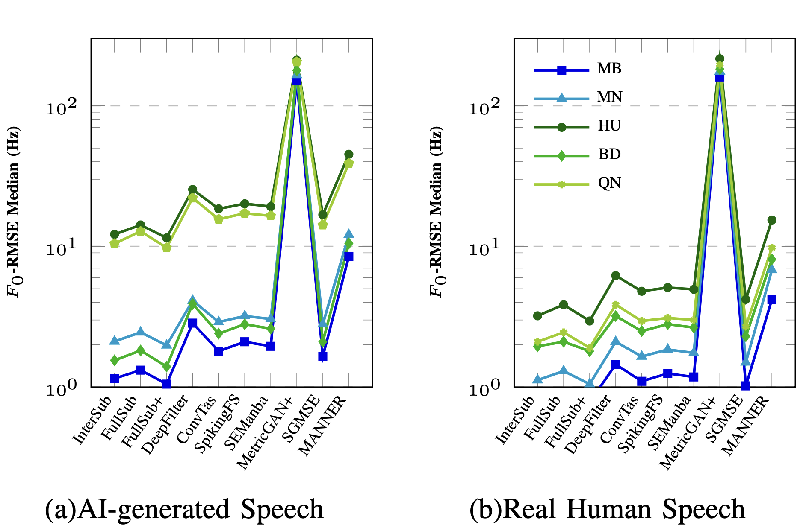

# PESEM-VS: An F0-RMSE-Driven Empirical Study of Speech Enhancement Models for Vietnamese Speech

> Speech enhancement models are overwhelmingly developed and validated on English-centric corpora. **PESEM-VS** is an empirical study that puts ten representative speech enhancement architectures to the test on **Vietnamese**, a tonal language where pitch (F0) contours carry lexical meaning — something standard metrics like PESQ and STOI simply cannot capture.

---

## ✨ Why this matters

A model can score high on PESQ and STOI while **silently destroying the pitch contours that carry word meaning in Vietnamese**. Existing benchmarks never test for this. PESEM-VS introduces two new metrics — **F0-RMSE** and **Pitch Failure Rate (PFR)** — to expose this blind spot.

## 📊 Results

We evaluate ten speech enhancement models on Vietnamese speech using PESQ, STOI, F0-RMSE, and PFR. Two clear behavioral tiers emerge:

- **Sub-band architectures** (InterSubNet, FullSubNet, FullSubNet+) consistently deliver strong perceptual quality *and* low pitch distortion.
- **Metric-driven / attention-based models** (MetricGAN+, MANNER) can post competitive or even higher perceptual scores while severely distorting pitch — a gap invisible to PESQ/STOI alone.

Fine-tuning experiments further reveal a **Perceptual–Tonal Decoupling Effect**: adapting a model to improve perceptual quality does not guarantee — and can even worsen — pitch preservation, showing that these are independent optimization objectives.

Findings are consistent across regional accents and across AI-generated vs. real human speech, indicating that pitch degradation is architecture-driven rather than accent- or source-specific:

> Full quantitative tables and detailed discussion are available in the paper (Section IV).

## 📁 Dataset

- **200 clean Vietnamese utterances**: 20 script sentences × 2 voice sources (AI-synthesized via EverAI TTS, and real human recordings) × 5 regional accents (Northern, Southern, Hue, Binh Dinh, and a fifth region that differs by source — Nghe An for synthetic, Quang Nam for natural speech).
- **47 noise recordings** from the [DNS Challenge Noise Dataset](https://github.com/microsoft/DNS-Challenge).
- **9,400 noisy samples** generated by pairing every clean utterance with every noise clip at a fixed 10 dB SNR, normalized to −16 dBFS.
- **Split:** 180 clean / 8,460 noisy for train (sentences S03–S20), 20 clean / 940 noisy for test (sentences S01–S02).

📦 Full dataset available on Hugging Face: **[KhaBui/PESEM-VS](https://huggingface.co/datasets/KhaBui/PESEM-VS)**

## 📐 Metrics

| Metric | What it measures | Range |
|---|---|---|
| **PESQ** | Perceptual speech quality | −0.5 to 4.5 |
| **STOI** | Intelligibility | 0 to 1 |
| **F0-RMSE** | Pitch contour preservation (RMSE between clean/enhanced F0, extracted via pYIN in `librosa`) | Hz, lower is better |
| **PFR** | Pitch Failure Rate — % of utterances where F0-RMSE is undefined because pitch extraction fails | % |

## 🏗️ Models Evaluated

| Category | Model |
|---|---|
| Time/TF-domain | [Conv-TasNet](https://github.com/JusperLee/Conv-TasNet) |
| Time/TF-domain | [DeepFilterNet](https://github.com/Rikorose/DeepFilterNet) |
| Sub-band & multi-stage | [FullSubNet](https://github.com/Audio-WestlakeU/FullSubNet) |
| Sub-band & multi-stage | [FullSubNet+](https://github.com/RookieJunChen/FullSubNet-plus) |
| Sub-band & multi-stage | [InterSubNet](https://github.com/RookieJunChen/Inter-SubNet) |
| Lightweight / advanced | [SEManba](https://github.com/RoyChao19477/SEMamba) |
| Lightweight / advanced | [MANNER](https://github.com/winddori2002/MANNER) |
| Lightweight / advanced | [SpikingFullSubNet](https://github.com/haoxiangsnr/spiking-fullsubnet) |
| Generative / metric-driven | [MetricGAN+](https://github.com/wooseok-shin/MetricGAN-plus-pytorch) |
| Generative / metric-driven | [SGMSE](https://github.com/sp-uhh/sgmse) |

📦 Fine-tuned checkpoints: **[KhaBui/PESEM-VS on Hugging Face](https://huggingface.co/KhaBui/PESEM-VS/tree/main)**

## 🙏 Acknowledgements

- Noise data from the [DNS Challenge](https://github.com/microsoft/DNS-Challenge) corpus.
- Synthetic speech generated with the EverAI text-to-speech engine.
